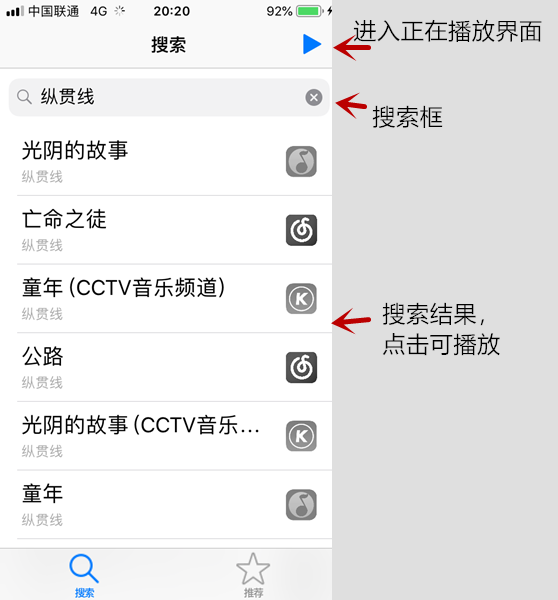
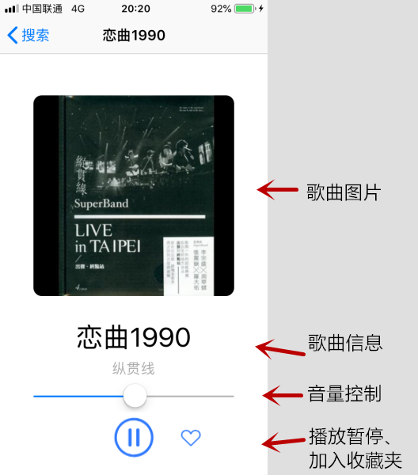
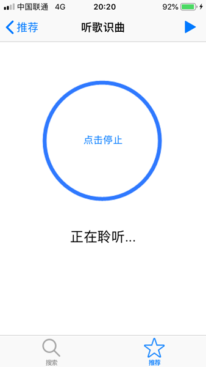
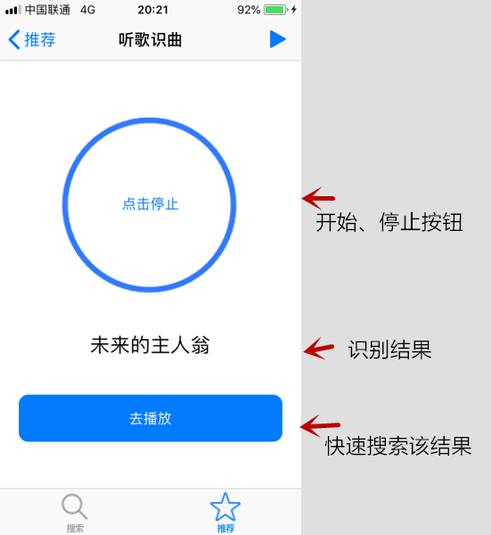
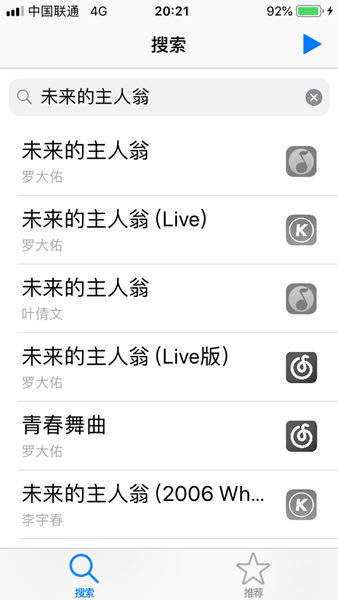
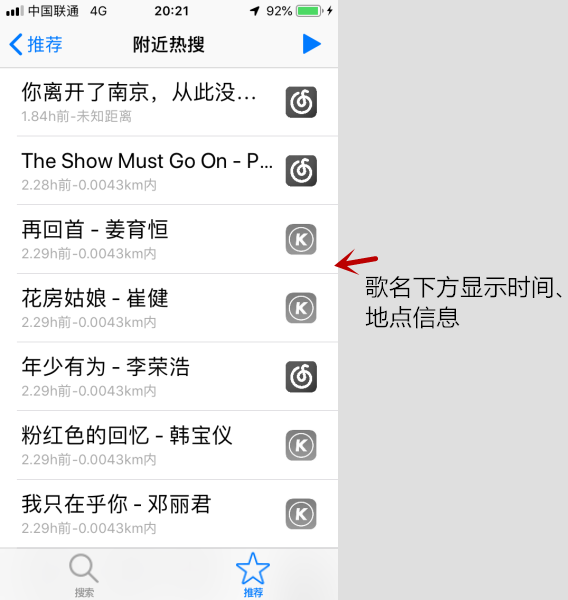
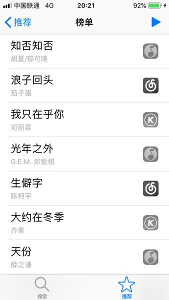
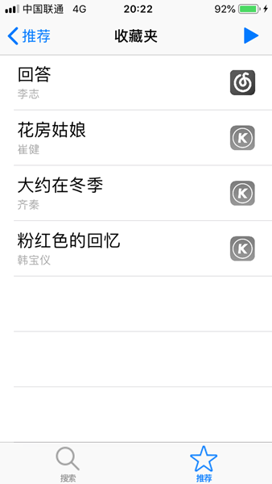
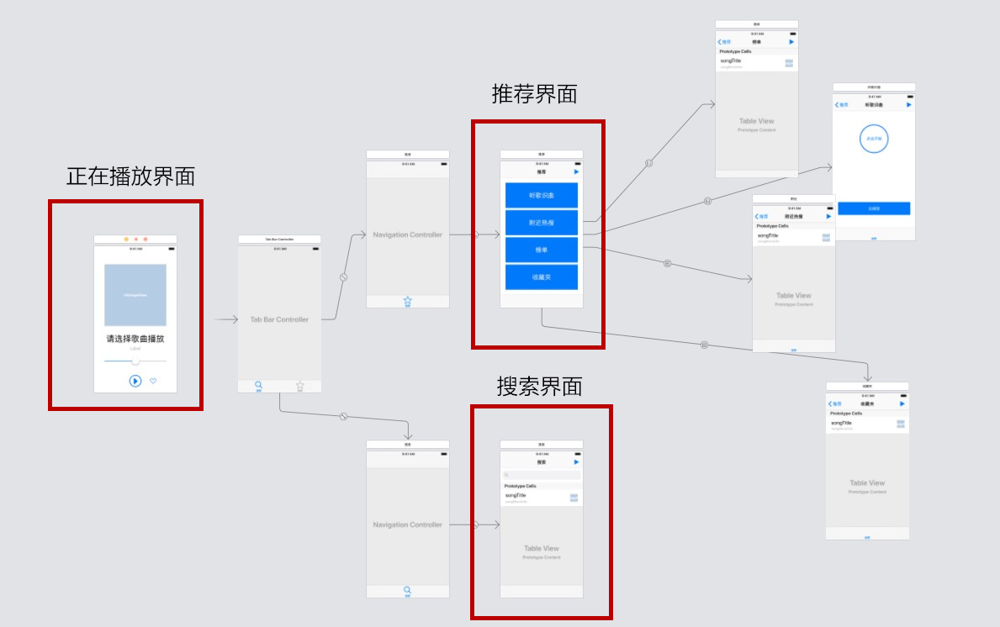
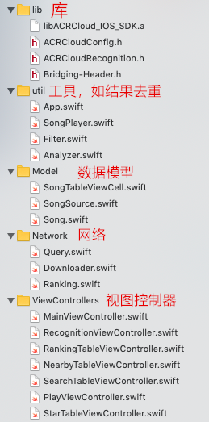

# 简介
本项目是[app-2018f课程](https://github.com/njuics/app-2018f)的大作业，实现了一个iOS平台的聚合音乐搜索应用。本文档分为以下两个部分：
- [使用说明](#1)
- [技术说明](#2)

由于本应用依赖于部分第三方API、自建的服务端等不可控的网络因素，当出现问题时，可以通过以下链接确认是否为API自身问题：
- [“音乐搜索”功能API(第三方)](https://api.bzqll.com/music/kugou/search?key=579621905&s=123&limit=100&offset=0&type=song)
- [“音乐播放”功能API(第三方)](https://m10.music.126.net/20190111235154/4c06c2d17c630605fa88b9b28a8b2bf5/ymusic/fdcc/b00e/d47a/872bf5a1ec26adbd82f92d6584773f19.mp3)
- [“附近热搜”功能API(自建)](http://111.231.74.95/data)
- “听歌识曲”功能使用[ACRCloud](http://console.acrcloud.cn)提供的试用版接口，该接口将于2019年1月23日左右到期。

## 网络要求
- 测试时请关闭VPN
- 第三方API在移动蜂窝数据环境下比南京大学校园网更稳定

## 开发、测试环境
- XCode 10.1 (10B61)
- macOS Mojave 10.14.1 (10B61)
- iOS 12.1(16B92)

<h1 id="1">使用说明</h1>

## 背景
- [【新闻】腾讯QQ音乐下架大量歌曲，平台版权之争再起变数](https://www.ithome.com/html/it/349723.htm)

- [【新闻】网易云音乐“因合作方要求”，大批歌曲资源下架](https://www.ithome.com/html/it/214357.htm)

- [【讨论】针对目前国内分散的音乐版权，作为开发者，有什么可行的解决方案？](https://www.v2ex.com/t/265405)

## 问题
音乐版权的分散导致用户在查找歌曲时，常常需要在多个App搜索才能找到，且耗费较多时间在多次输入关键字、看开屏广告上。

## App功能
聚集网易云音乐、QQ音乐、酷狗音乐三个平台的资源，以“歌曲查找”为核心目标提供以下六种功能：

1、当用户有确切目标时：
- 【聚合音乐搜索】根据用户输入的**关键字**，同时搜索以上三个平台的资源

- 【听歌识曲】根据麦克风接收的**声音信息**，识别周围“正在播放或哼唱”的歌曲名称

2、当用户没有确切目标时：
- 【聚合音乐榜单】将以上三个平台的音乐排行榜聚集、去重，以获取覆盖范围更广的榜单

- 【附近热搜】根据手机定位，获取附近区域内他人的热门搜索记录

3、其他功能：
- 【音乐试听】以上查找到的资源，可以在App内试听

- 【收藏夹】可以将查找到的资源收藏为持久化数据

## 界面说明
1、搜索界面



<br/>

2、试听界面



<br/>

3、推荐界面


<br/>

4、听歌识曲界面







<br/>

5、附近热搜界面



<br/>

6、榜单界面



<br/>

7、收藏夹界面



<br/>

<h1 id="2">技术说明</h1>

1、系统框架

- 视图的树结构


- 代码主要分为5个Group：



下面详细介绍这些模块的功能。

<br/>

2、音乐搜索、榜单（网络通讯，JSON解析）

这一部分基于[BZQLL](https://www.bzqll.com/)提供的API，使用NSURLSession实现网络通讯以提供音乐搜索、榜单获取的服务。核心代码在```Query.swift```文件中。

在进行网络通讯时，首先生成一个URLSession对象，然后用它生成的dataTask发送Http请求，同时提供一个completion函数定义Http请求返回后的操作。以下代码是一个简单的示例：
```swift
dataTasks[source] = urlSession.dataTask(with: url){data,response,error in
    defer {
        //确保函数结束后dataTasks[source]为nil
        self.dataTasks[source] = nil
    }
    if let e = error{
        //Http请求失败
        print(e.localizedDescription)
        successful = false;
    }else if let d = data,
    let res = response as? HTTPURLResponse,res.statusCode == 200{
        //Http请求成功，更新本地数据
        self.updateData(source: source, data: d)
        successful = true
    }
    //使用completion函数通知调用者该函数执行结束
    DispatchQueue.main.async {
        completion(successful)
    }
}
```

从API获取到的是JSON格式的数据，此处使用```JSONSerialization.jsonObject()```函数解析。

<br/>

3、音乐播放（AVPlayer）

在搜索得到音乐的下载地址后，使用```AVPlayer```播放。此处做了简单的封装，使用组合的设计模式实现```SongPlayer```类，提供了```play()```、```pause()```、```playNewSong()```等操作接口，及两个获取播放器状态的查询接口。
```swift
// 操作接口
func playNewSong(songUrl urlStr:String){}
func play(){}
func pause(){}
func setVolume(_ volume:Float) {}
// 查询状态接口
func isPlaying()->Bool{}
func hasSongToPlay()->Bool{}
```

<br/>

4、听歌识曲（ACRCloud）

听歌识曲功能使用了[ACRCloud](http://console.acrcloud.cn)提供的服务，项目中lib群组下的所有文件均来自于ACRCloud库。该功能的主要流程是：麦克风接收用户周围环境的一段音频，上传至ACRCloud服务器进行解析与匹配，当匹配率大于某个值时将其作为结果返回。

该服务的使用比较简单，在```RecognitionViewController```中定了一个函数，用于控制```ACRCloudRecognition```服务的启动与结束，同时将识别的结果现实到屏幕上，并提供直接使用该结果作为关键字搜索的按钮。

<br/>

5、附近热搜（定位服务，后台服务）

定位服务使用```CLLocationManager```获取，由于只需要识别大致的区域范围，因此选择了百米级别的精度。为了方便多处使用定位信息，获取到的位置保存在```App```类的```static var coordinate```中。

获取位置的核心代码如下：
```swift
//将NearbyTableViewController作为其delegate
locationManager.delegate = self
//百米级别的精度
locationManager.desiredAccuracy = kCLLocationAccuracyHundredMeters
//若尚未授权，则申请授权
if CLLocationManager.authorizationStatus() == .notDetermined{
    locationManager.requestWhenInUseAuthorization()
}
//开始更新位置
locationManager.startUpdatingLocation()

//在某处停止更新位置
//...
```

后台服务则使用Python的Flask框架搭建，在用户同意提供定位权限后，提供了两个API：
- 当用户点击一首歌曲播放时，歌曲信息、定位信息将上传至服务器
- 当用户查看“附近热搜”列表时，将根据其定位获取数据库中的统计信息，生成列表（会筛去用户自身的搜索记录，只留下他人的统计信息）

这两个API的格式如下：
```python
@app.route('/update')
def update():
    latitude = request.args.get('latitude')
    longitude = request.args.get('longitude')
    # And so on

@app.route('/data')
def nearby():
    latitude = request.args.get('latitude')
    longitude = request.args.get('longitude')
    # And so on
```

此外，这一部分也使用```UIRefreshControl()```实现下滑刷新，以获取最新数据。

<br/>

6、收藏夹（数据持久化）

这一部分通过```NSCoding```实现了数据持久化保存，将用户标记为“喜爱”的歌曲存放在收藏夹中。

首先，为```class Song```实现```NSObject, NSCoding```协议，使其可以被编码保存。在实现这一部分时花费较多的时间处理系统报错，最后发现是因为```Song```中含有```enum```类型导致无法直接编码，因此改为保存```enum SongSource```类型的rawValue。编码的核心过程如下（解码是其逆过程，不再赘述）：

```swift
func encode(with aCoder: NSCoder) {
    aCoder.encode(title, forKey: PropertyKey.title)
    aCoder.encode(artist, forKey: PropertyKey.artist)
    aCoder.encode(String(source.rawValue), forKey: PropertyKey.source)
    aCoder.encode(downloadUrl, forKey: PropertyKey.downloadUrl)
    aCoder.encode(imageUrl, forKey: PropertyKey.imageUrl)
}
```

其次，在```StarTableViewController```中实现两个函数，分别用于保存数据、读取数据：
```swift
//保存数据
static func saveSongs() {
    do{
        let data = try NSKeyedArchiver.archivedData(withRootObject: starSongs, requiringSecureCoding: false)
        try data.write(to: URL(fileURLWithPath: Song.ArchiveURL.path))
    }catch {
        return
    }
}

//读取数据 
func loadSongs()->[Song]?{
    do{
        let ret = try NSKeyedUnarchiver.unarchiveTopLevelObjectWithData(Data(contentsOf: URL(fileURLWithPath: Song.ArchiveURL.path))) as? [Song]
        return ret
    }catch{
        return nil
    }
} 
```

# 参考资料
- [Start Developing iOS Apps (Swift)](https://developer.apple.com/library/archive/referencelibrary/GettingStarted/DevelopiOSAppsSwift/)
- [BZQLL音乐搜索API文档](http://api.bzqll.com/)
- [ACRCloud Docs](https://www.acrcloud.com/docs/acrcloud/demos/ios-demo/)
