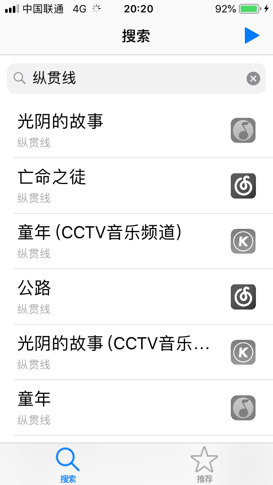
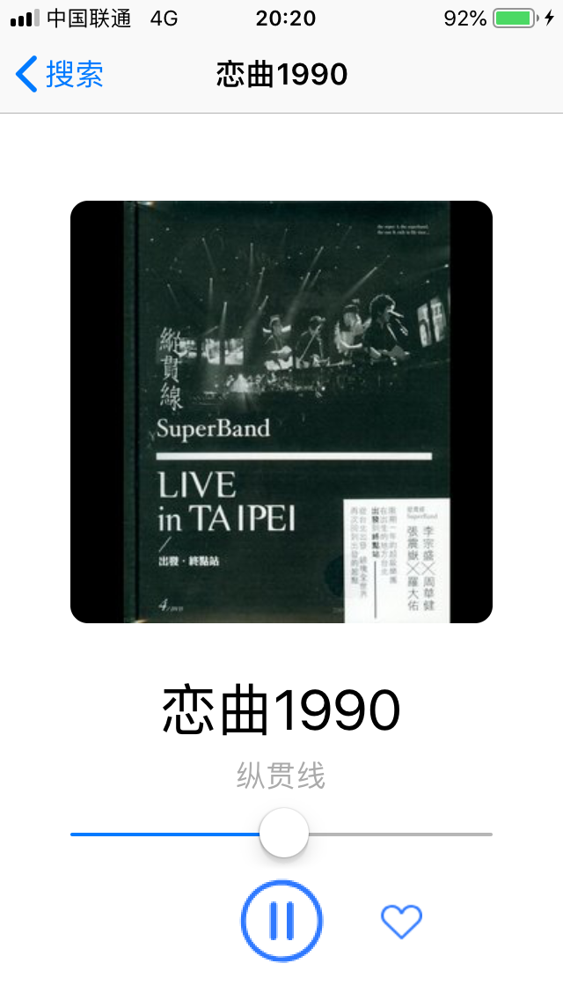
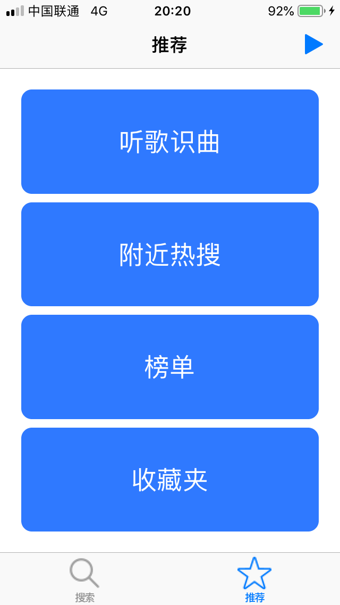
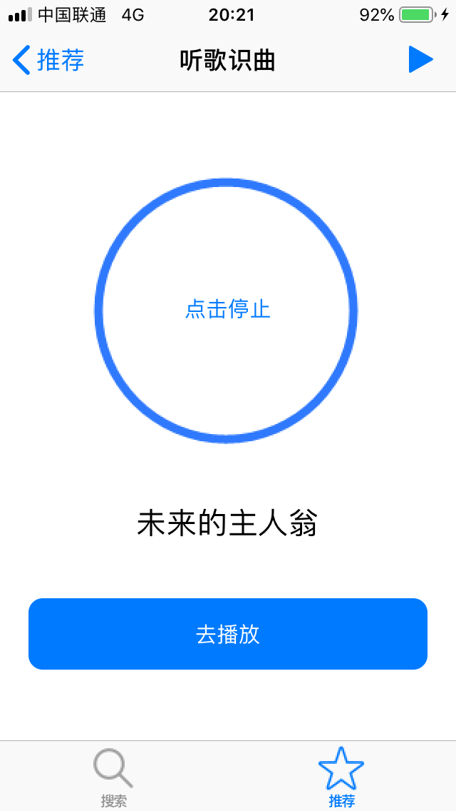
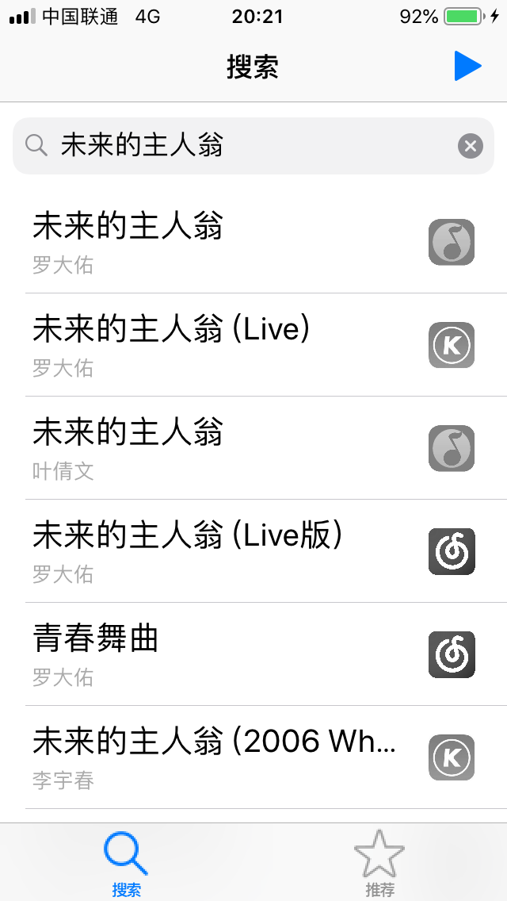
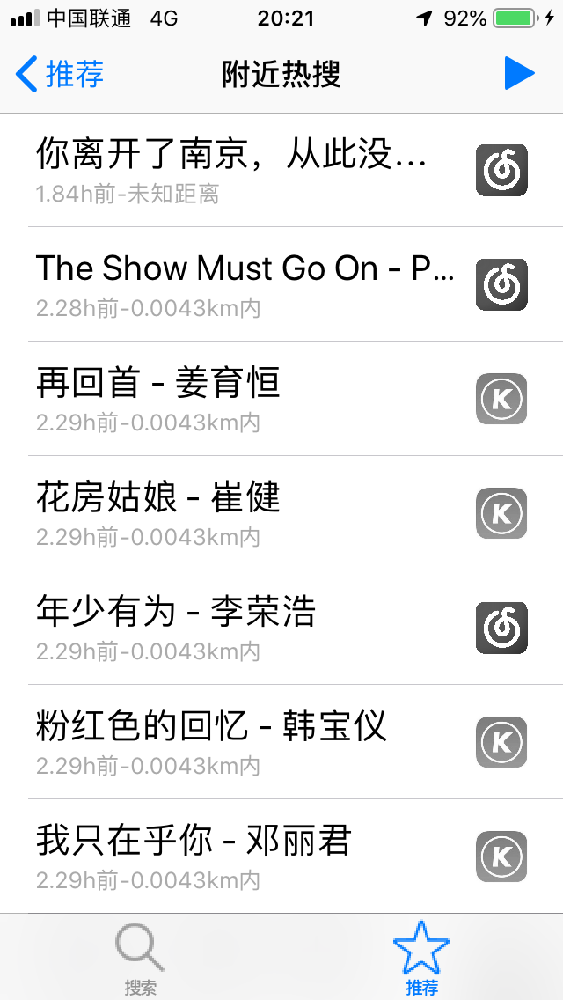
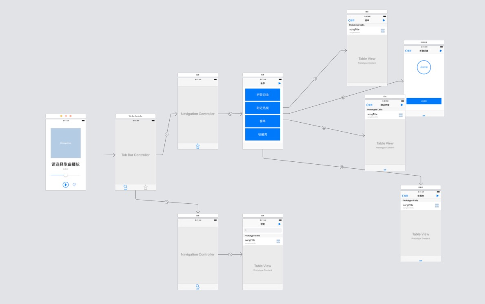

# 简介
本项目是[app-2018f课程](https://github.com/njuics/app-2018f)的大作业，实现了一个iOS平台的聚合音乐搜索应用。本文档分为以下两个部分：
- [使用说明](#1)
- [技术说明](#2)

由于本应用依赖于部分第三方API、自建的服务端等不可控的网络因素，当出现问题时，可以通过以下链接确认是否为API自身问题：
- [“音乐搜索”功能API(第三方)](https://api.bzqll.com/music/kugou/search?key=579621905&s=123&limit=100&offset=0&type=song)
- [“音乐播放”功能API(第三方)]()
- [“附近热搜”功能API(自建)](http://111.231.74.95/data)
- “听歌识曲”功能使用[ACRCloud](http://console.acrcloud.cn)提供的试用版接口，该接口将于2019年1月23日左右到期。

## 网络要求
- 测试时请关闭VPN
- 第三方API在移动蜂窝数据环境下比南京大学校园网更稳定

## 开发、测试环境
- XCode 10.1 (10B61)
- macOS Mojave 10.14.1 (10B61)
- iOS 12.1(16B92)

<h1 id="1">使用说明</h1>

## 背景
- [【新闻】腾讯QQ音乐下架大量歌曲，平台版权之争再起变数](https://www.ithome.com/html/it/349723.htm)

- [【新闻】网易云音乐“因合作方要求”，大批歌曲资源下架](https://www.ithome.com/html/it/214357.htm)

- [【讨论】针对目前国内分散的音乐版权，作为开发者，有什么可行的解决方案？](https://www.v2ex.com/t/265405)

## 问题
音乐版权的分散导致用户在查找歌曲时，常常需要在多个App搜索才能找到，且耗费较多时间在多次输入关键字、看开屏广告上。

## App功能
聚集网易云音乐、QQ音乐、酷狗音乐三个平台的资源，以“歌曲查找”为核心目标提供以下六种功能：

1、当用户有确切目标时：
- 【聚合音乐搜索】根据关键字，同时搜索以上三个平台的资源
- 【听歌识曲】根据麦克风接收的声音信息，识别当前播放或哼唱的歌曲名称，然后作为关键字同时搜索以上三个平台

2、当用户没有确切目标时：
- 【聚合音乐榜单】将以上三个平台的音乐排行榜聚集、去重，以获取覆盖范围更广的榜单

- 【附近热搜】根据手机定位，获取附近区域内他人的热门搜索记录

3、其他功能：
- 【音乐试听】以上查找到的资源，可以在App内试听
- 【收藏夹】可以将查找到的资源收藏为持久化数据

## 界面说明
1、搜索界面


2、试听界面


3、推荐界面


4、听歌识曲界面






5、附近热搜界面


6、榜单界面


7、收藏夹界面


<h1 id="2">技术说明</h1>
1、系统框架



2、音乐搜索、榜单（网络通讯，JSON解析）

这一部分基于[BZQLL](https://www.bzqll.com/)提供的API，使用NSURLSession实现网络通讯以提供音乐搜索、榜单获取的服务。核心代码在```Query.swift```文件中。

在进行网络通讯时，首先生成一个URLSession对象，然后用它生成的dataTask发送Http请求，同时提供一个completion函数定义Http请求返回后的操作。以下代码是一个简单的示例：
```swift
dataTasks[source] = urlSession.dataTask(with: url){data,response,error in
    defer {
        //确保函数结束后dataTasks[source]为nil
        self.dataTasks[source] = nil
    }
    if let e = error{
        //Http请求失败
        print(e.localizedDescription)
        successful = false;
    }else if let d = data,
    let res = response as? HTTPURLResponse,res.statusCode == 200{
        //Http请求成功，更新本地数据
        self.updateData(source: source, data: d)
        successful = true
    }
    //使用completion函数通知调用者该函数执行结束
    DispatchQueue.main.async {
        completion(successful)
    }
}
```

从API获取到的是JSON格式的数据，此处使用```JSONSerialization.jsonObject()```函数解析。

2、音乐播放（AVPlayer）

在搜索得到音乐的下载地址后，使用```AVPlayer```播放。此处做了简单的封装，使用组合的设计模式实现```SongPlayer```类，提供了```play()```、```pause()```、```playNewSong()```等操作接口，及两个获取播放器状态的查询接口。
```swift
// 操作接口
func playNewSong(songUrl urlStr:String){}
func play(){}
func pause(){}
func setVolume(_ volume:Float) {}
// 查询状态接口
func isPlaying()->Bool{}
func hasSongToPlay()->Bool{}
```

3、听歌识曲（ACRCloud）

听歌识曲功能使用了[ACRCloud](http://console.acrcloud.cn)提供的服务，项目中lib群组下的所有文件均来自于ACRCloud库。

该服务的使用比较简单，在```RecognitionViewController```中定了一个函数，用于控制```ACRCloudRecognition```服务的启动与结束，同时将识别的结果现实到屏幕上，并提供直接使用该结果作为关键字搜索的按钮。

4、附近热搜（后台服务）

这一部分使用Python的Flask框架搭建，
